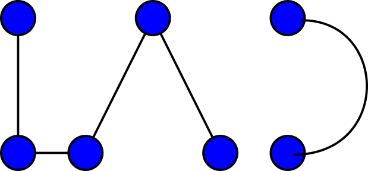
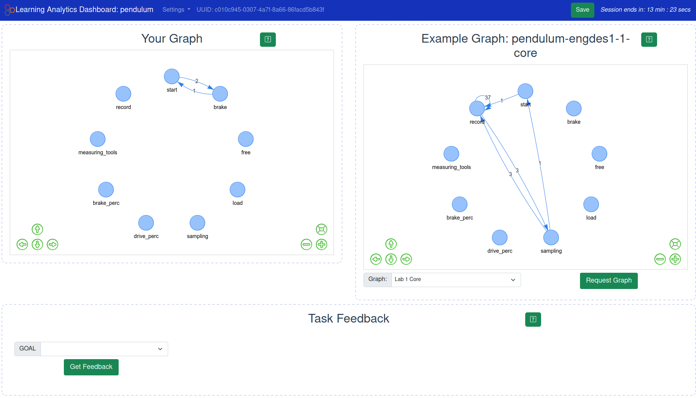
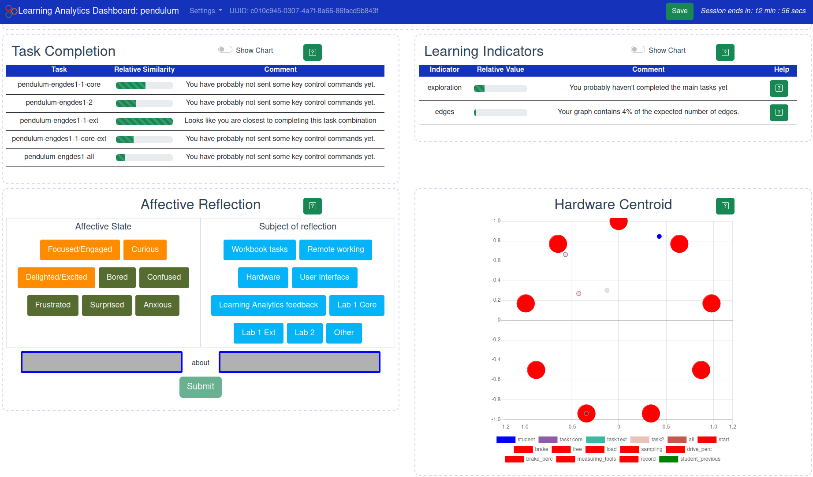

# Learning Analytics Dashboard



This Learning Analytics Dashboard (LAD) works with the [spinner](https://github.com/practable/spinner-amax) and [pendulum](https://github.com/practable/penduino) practable.io remote labs. The UI versions for those labs need to have analytics enabled, so choose the `analytics` directory in `ui/`.

The LAD requires the learning analytics python client to be running on a server as well. See details of that setup and code [here](https://github.com/dpreid/learning-analytics-server).

The core of the dashboard is the display of a user graph representing the procedure followed by a student during remote lab work.



The dashboard also displays other learning indicators calculated by the learning analytics client.



## Interaction with analytics client

The LA dashboard will request data from the analytics client using the logging websocket. This is passed to the dashboard via the url query parameter when the UI is selected.

The requests use the ```{..., type: "analytics", ...}``` format. 

There is additional logging from the analytics dashboard as well to quantify the level of interaction with the LA dashboard. This logging is not reflected in the data presented to students (but could be in future updates).

This logging is performed when:

- on pageshow event which is added as a listener in the App.vue component
- @mouseenter for each of the analytics dashboard components individually
- when data is saved by the student using the Save button in the NavigationBar.vue component
- when any request for data is sent (excluding request_all as pageshow will cover this scenario) in the logging.js data store.
- when feedback is submitted in the logging.js store.

## Setup

Details of setting up the UI are given in `dashboard/README.md`.

Basics:
- Clone this repo to your local machine.
- `cd dashboard`
- `npm install`
- `npm run build`
- Use the generated build directory to serve wherever and however you host webpages.