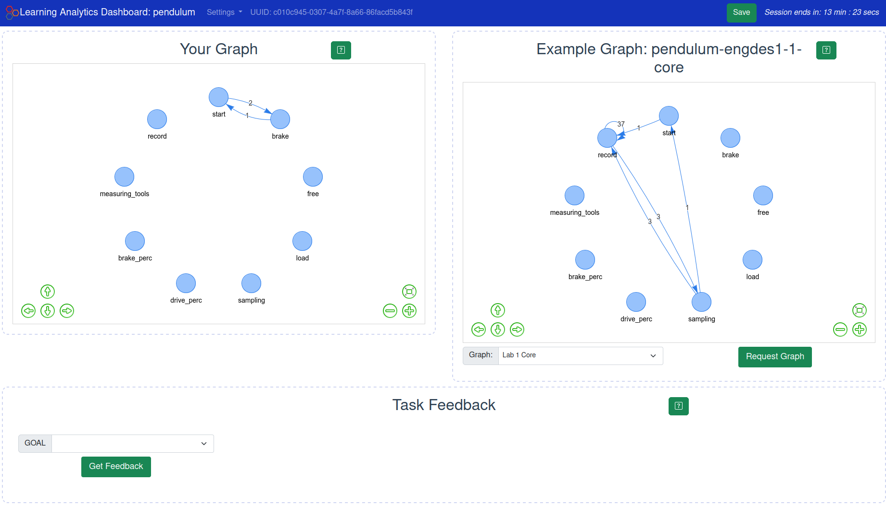
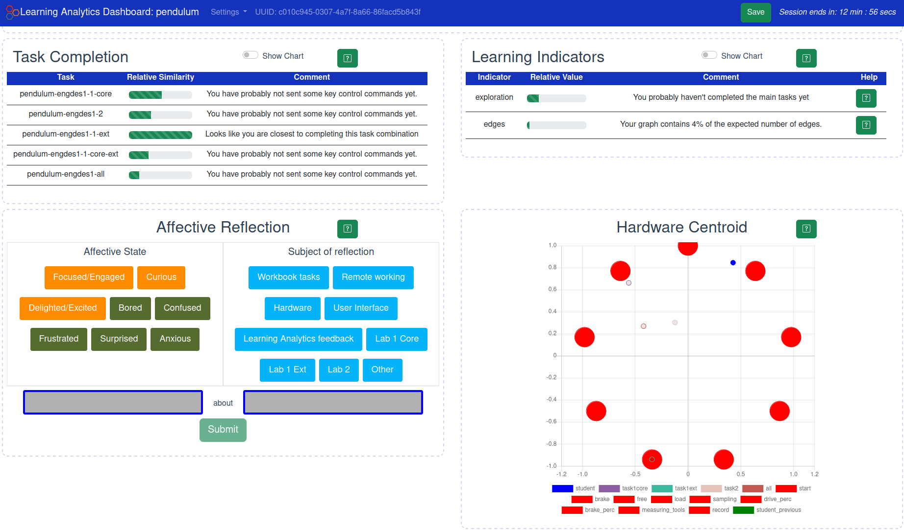

# Learning Analytics Dashboard


This repo is under active development and is not yet in a release state.

This Learning Analytics Dashboard (LAD) currently works with the [spinner](https://github.com/practable/spinner-amax) and [pendulum](https://github.com/practable/penduino) practable.io remote labs. The UI versions for those labs need to have analytics enabled, so choose the `analytics` directory in `ui/`.

The LAD requires the learning analytics server to be running as well. See details of that setup and code [here](https://github.com/practable/analytics).

The core of the dashboard is the display of a user graph representing the procedure followed by a student during remote lab work.



The dashboard also displays other learning indicators calculated by the learning analytics server.



# Required query params

When accessing the SFLA dashboard, the dashboard needs to know the course and hardware so that it can access the correct logging data and expectation graphs. This info is passed in URL query parameters e.g.:

```
http://localhost:5173/?course=ed1&hardware=spinner&hardware=pendulum&th=https://app.practable.io/ed-log-dev/analytics/taskcompare/api/v1&ch=http://127.0.0.1:5000&config=/local/config.json
```

The config file is stored locally in public for development purposes.

If a course uses multiple labs, then each can be added as a `hardware=` parameter and this gets combined into an array in javascript.

# TODO

- Update CSS style and check responsive design
- Use a config file to generate the necessary comments etc for specific course and hardware combinations instead of hard coding different hardware into the UI
- Remove the current development config, which is loaded from a local file i.e. remove /local from the /public directory
- Add all existing components and update as necessary
- Create new components
- Add security

# Components

## GraphDisplay

Used for both the student and comparison graphs

## UsageStats (NEW)

Descriptive statistics that are not necessarily connected to TaskCompare or other learning analytics, but are associated with engagement with the system. Perhaps most relevant for staff/researchers organising access to the system and to understand when students are using remote labs, but available to students as well. Current statistics:

- counts of logged interactions
- total count of logs
- number of different days a student has interacted with the system

TODO:

- time of day count (within specific intervals e.g. morning, afternoon, evening?)
- interaction timeline - select an interaction log and provides a timeline of when these interactions took place

### Affective Reflection

TODO:

- requires connection with logging analytics to log student responses

### Task Completion

TODO:

- Update simple line chart to reflect changes in latest chart.js version. Colours in chart need to loop colour array, not use a fixed array index.
- Need to reconsider the comments being used
- Provide multiple visualisations of task completion e.g. relative similarity, TaskCompare through time, change in TC score for each task (i.e. no time axis)


### Indicators

Indicators component currently only shows total edge percentage. Will need to integrate TaskExploration at least, but the separation of TaskExploration from other indicators in the backend means a different approach to showing it in front-end OR reintegrate it into the indicators response from backend.

### Task Feedback

Needs the backend implemented and redone with a configuration file


### Cohort Comparison (NEW TODO)


### TaskComplexity (NEW TODO)


# Setup

Basics:
- Clone this repo to your local machine.
- `cd dashboard`
- `npm install`
- `npm run build`
- Use the generated build directory to serve wherever and however you host webpages.

## Project setup
```
npm install
```

### Compiles and hot-reloads for development
```
npm run dev
```

### Compiles and minifies for production
```
npm run build
```

### Lints and fixes files
```
npm run lint
```

